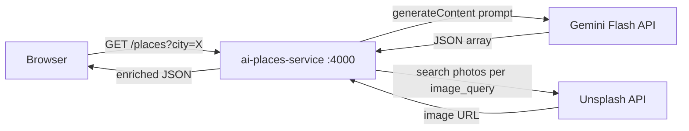

# AI Places Microservice — Full Stack

## Architecture




## Files to create / modify

### 1. `[backend/src/ai-places-service/src/server.js](backend/src/ai-places-service/src/server.js)`

Replace the skeleton with a full Express server:

- Install `cors` and `dotenv` as dependencies (`npm install cors dotenv`)
- `GET /places?city=<name>` — builds the Gemini prompt, calls `https://generativelanguage.googleapis.com/v1beta/models/gemini-2.0-flash:generateContent`, parses the JSON array from `candidates[0].content.parts[0].text`
- For each place, calls `https://api.unsplash.com/search/photos?query=<image_query>&per_page=1&client_id=<key>` and attaches `image: results[0].urls.regular`
- Fires all 10 Unsplash requests in parallel with `Promise.all`
- Simple in-memory cache (`Map`) with a 1-hour TTL to avoid redundant API calls on repeated requests for the same city
- Listens on `PORT` env var (default `4000`)
- CORS open for development

### 2. `[backend/src/ai-places-service/Dockerfile](backend/src/ai-places-service/Dockerfile)` — new file

```dockerfile
FROM node:20-alpine
WORKDIR /app
COPY package*.json ./
RUN npm ci --omit=dev
COPY src/ ./src/
EXPOSE 4000
CMD ["node", "src/server.js"]
```

`.env` is NOT copied into the image — injected at runtime via `env_file` in Compose.

### 3. `[docker-compose.yml](docker-compose.yml)`

Add the new service (no dependencies on vault/database — it is stateless):

```yaml
ai-places:
  build: ./backend/src/ai-places-service
  container_name: ai-places
  ports:
    - "4000:4000"
  env_file:
    - ./backend/src/ai-places-service/.env
  networks:
    - saas
  restart: on-failure
```

### 4. `[frontend/src/pages/CityPage.tsx](frontend/src/pages/CityPage.tsx)`

- Remove the `MARRAKESH_PLACES` mock array
- Add `image: string` already exists on the `Place` interface — no change needed there
- Add a `usePlaces(city)` hook that `fetch`es `${VITE_AI_PLACES_URL}/places?city=${city}`, returns `{ places, loading, error }`
- Replace the static list with state-driven rendering: skeleton cards while loading, an error notice on failure, and the real cards once data arrives
- The `VITE_AI_PLACES_URL` env var defaults to `http://localhost:4000`

**Search bar** — placed in the hero section, centered, overlaid on the background image above the scroll chevron:

- Controlled `input` (`cityInput` state) + a submit button with a search icon
- On submit: trims the value, updates the active `city` state (which `usePlaces` watches), and smoothly scrolls the page down to the recommendations section
- While `loading` is true the button shows a small spinner and is disabled
- Default city on first load: `"Marrakesh"` (pre-filled in the input so the page is never empty on arrival)

### 5. `[frontend/.env](frontend/.env)` — new file

```
VITE_AI_PLACES_URL=http://localhost:4000
```

